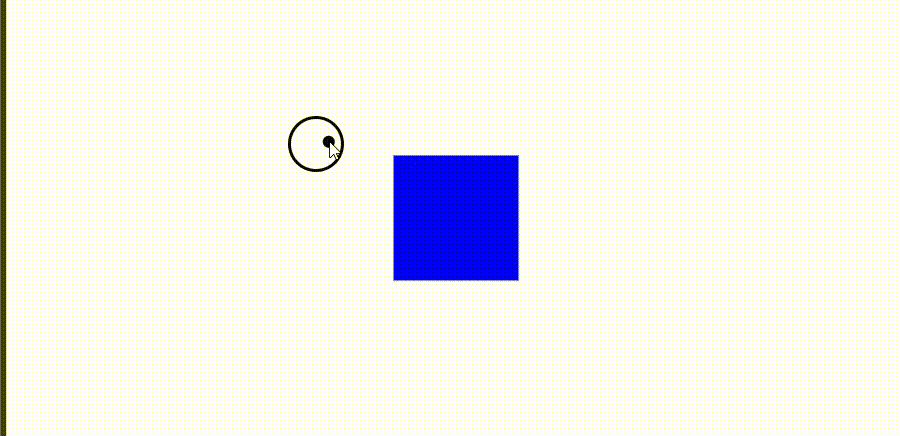

# Custom Cursor with Hover Effect

This project demonstrates how to create a custom cursor with a hover effect using HTML, CSS, and JavaScript. The custom cursor increases in size when hovering over a specific element and returns to its original size when not hovering over it.

## Preview



## How to Use

1. You can directly copy and paste the following HTML code into your project:

```html
<!DOCTYPE html>
<html lang="en">
<head>
    <meta charset="UTF-8">
    <meta name="viewport" content="width=device-width, initial-scale=1.0">
    <title>Custom Cursor with Hover Effect</title>
    <style>
        * {
            height: 100%;
            width: 100%;
            margin: 0;
            padding: 0;
        }

        body {
            display: flex;
            justify-content: center;
            align-items: center;
        }

        .cursor-dot {
            width: 10px;
            height: 10px;
            background-color: #070707;
            position: absolute;
            border-radius: 50%;
            z-index: 999;
            pointer-events: none;
            mix-blend-mode: difference;
            display: none;
        }

        .cursor-outline {
            width: 40px;
            height: 40px;
            border: 3px solid #070707;
            overflow: hidden;
            position: absolute;
            border-radius: 50%;
            z-index: 998;
            pointer-events: none;
            mix-blend-mode: difference;
            display: none;
        }

        .card {
            height: 100px;
            width: 100px;
            background-color: red;
            position: fixed;
            top: 50%;
            left: 50%;
            transform: translate(-50%, -50%);
        }
    </style>
</head>
<body>
    <div class="cursor-dot" data-cursor-dot></div>
    <div class="cursor-outline" data-cursor-outline></div>
    <div class="card hover"></div>
    <script>
       const cDot = document.querySelector("[data-cursor-dot]");
const cOutline = document.querySelector("[data-cursor-outline]");
const card = document.querySelector(".card");

// Function to handle mouse movement
function handleMouseMove(e) {
  const posX = e.clientX;
  const posY = e.clientY;

  cDot.style.left = `${posX}px`;
  cDot.style.top = `${posY}px`;

  cOutline.animate(
    { left: `${posX}px`, top: `${posY}px` },
    {
      duration: 500,
      easing: "linear",
      fill: "forwards",
    }
  );

  // Check if the cursor is directly over the card
  const rect = card.getBoundingClientRect();
  const isOnCard = (
    posX >= rect.left && posX <= rect.right &&
    posY >= rect.top && posY <= rect.bottom
  );

  // Adjust cursor size based on whether it's directly over the card or not
  if (isOnCard) {
    cDot.style.width = "20px";
    cDot.style.height = "20px";
  } else {
    cDot.style.width = "10px";
    cDot.style.height = "10px";
  }
}

// Add event listener for mouse movement
window.addEventListener("mousemove", handleMouseMove);

    </script>
</body>
</html>
